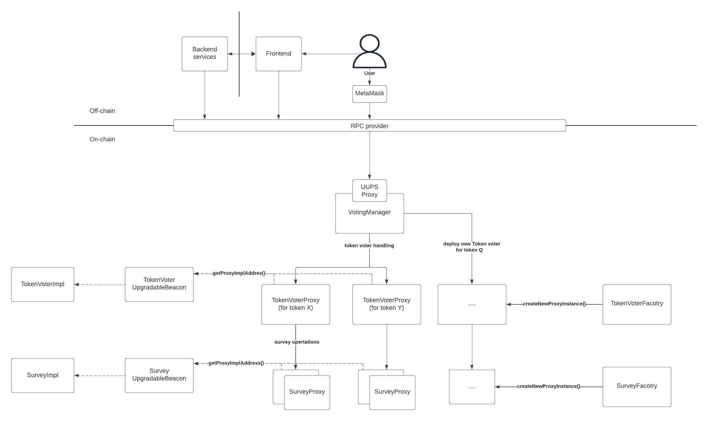

# Challenge 2

POC code is located in the `/src` directory. There are no tests, as agreed upon in the home assignment requirements.

Source code compiles with no errors: you can verify it with:
```
forge build
```


When reviewing the implementation, please take into consideration that there might be errors (and there certainly are) and missing functionalities. However, this is a POC that has not been tested or run locally. It is more a draft of the final implementation.

## Architecture Diagram:




## General Description

The project presents a solution for a voting system based on a token that users can stake. A user's voting power depends on the size of their stake.

Each token is associated with a separate `VotingToken` contract that handles token staking and unstaking, and maintains the surveys associated with that token. Voting power is exclusively linked to a given token and is not transferable to surveys for other tokens.

`Survey` contracts contain the voting logic. Each survey is time-constrained, and a user can vote only once per survey.

The main entry point to the project is the `VoterManager` contract, which dispatches calls to `TokenVoter` contracts that, in turn, call methods on selected `Survey` smart contracts.

## Detailed Description of Project Components

* `VotingManager`

  The entry point contract that dispatches calls to `TokenVoter` contracts. This contract is a UUPS (Universal Upgradeable Proxy Standard) proxy to allow for upgradeability.

* `TokenVoter`

  These contracts are responsible for voting delegation and user stake management. The amount of voting power per user is equal to the number of tokens they have deposited into a given `TokenVoter`.
  `TokenVoters` are proxy contracts that share the same logic. They are implemented using the Beacon chain proxy pattern to allow for the updating of `TokenVoter` code in a single transaction across all `TokenVoter` proxies.

* `Survey`

  The `Survey` contract holds the voting logic, performs vote validation, and returns the vote result. Surveys are proxy contracts that share the same logic. They are implemented using the Beacon chain proxy pattern, similar to `TokenVoters`, to allow for updating the `Survey` contract code in a single transaction for all survey proxies.

* `SurveyUpgradeableBeacon` and `TokenVoterUpgradeableBeacon`

  Implementations of `UpgradeableBeacon` from the OpenZeppelin library. They hold the upgradeable address for the proxies' implementation.

* `TokenVoterFactory` and `SurveyFactory`

  Factory contracts for creating `TokenVoter` and `Survey` beacon proxies. When creating a beacon proxy, they provide abi encoded instructions to initialize the proxy.

## Future Improvements

This draft implementation features basic, untested code.

Potential enhancements include:
* Adding tests to ensure reliability and security.
* Implementing reentrancy guards by incorporating the `ReentrancyGuard` dependency into the main contracts and using `nonReentrant` modifiers on sensitive methods.
* Extending the voting logic to prevent users from gaming the system through immediate depositing, voting, and withdrawing of tokens from `TokenVaults`. To curb this, a cooldown period (e.g., 7 days) for withdrawals could be introduced, or withdrawals might only be permitted after a survey has concluded. However, this isn't straightforward, as numerous edge cases need to be considered.
* Introducing additional roles for more granular access control within the contracts, beyond a sole admin/owner. The `AccessControlEnumerable` contract from the OpenZeppelin library could facilitate this.
* Adding ERC20 functionality to the `TokenVoter` contracts to mint and burn liquidity provider (LP) tokens upon staking and unstaking. This would provide users with tangible reassurance in the form of an LP token, serving as proof of their staked tokens.
* Creating scripts to automate deployment with Forge.
* Creating scripts to verify there are no storage slots conflicts when updating proxy.
* Replacing `require` statements with typed errors for better error handling.

To ensure the contract's security, in addition to addressing classic reentrancy issues with tests, we should conduct an external audit before launching the project into production.
